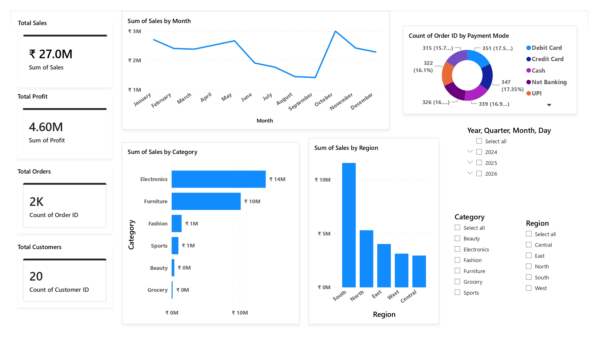

📊 **Retail Business Intelligence Dashboard**

📌 **Project Overview**
This project is a comprehensive 7-page Power BI dashboard developed to analyze retail business performance. It provides interactive visualizations and business insights on sales, customers, products, regions, delivery, and order performance.

---

🛠 **Tools & Technologies**
- Power BI Desktop
- Power Query
- DAX (Data Analysis Expressions)
- Microsoft Excel

---

📄 **Dashboard Pages**

1. Executive Dashboard
- Total Sales
- Total Profit
- Total Orders
- Total Customers
- Sales Trend
- Sales by Category
- Sales by Region

2. Customer Analytics
- Customer Distribution
- Gender Analysis
- Age Group Analysis
- Region-wise Customers
- Top Customers

3. Product Analytics
- Product Performance
- Category Analysis
- Top Selling Products
- Profit by Product
- Average Product Price

4. Regional Performance
- Regional Sales
- Regional Profit
- Delivery Performance
- Customer Rating by Region

5. Sales Performance Analysis
- Salesperson Performance
- Payment Mode Analysis
- Order Status
- Profit Margin

6. Order & Delivery Analysis
- Delivery Days
- Return Rate
- Order Status
- Payment Analysis
- Rating Analysis

7. Business Insights
- Best Selling Product
- Best Performing Region
- Most Used Payment Method
- Highest Sales Month
- Top Customer
- Top Product Category

---

📈 **Key Features**
- Interactive Dashboard
- Dynamic Filters (Slicers)
- KPI Cards
- Cross-filtering
- Business Insights
- Multiple Analytics Pages

---

📂 **Project Files**
- Retail_Business_Intelligence_Dashboard.pbix
- Retail_Dataset.xlsx
- Retail_Business_Intelligence_Dashboard.pdf

---

👩‍💻 Developed By
**Samala Sri Jyothika**
