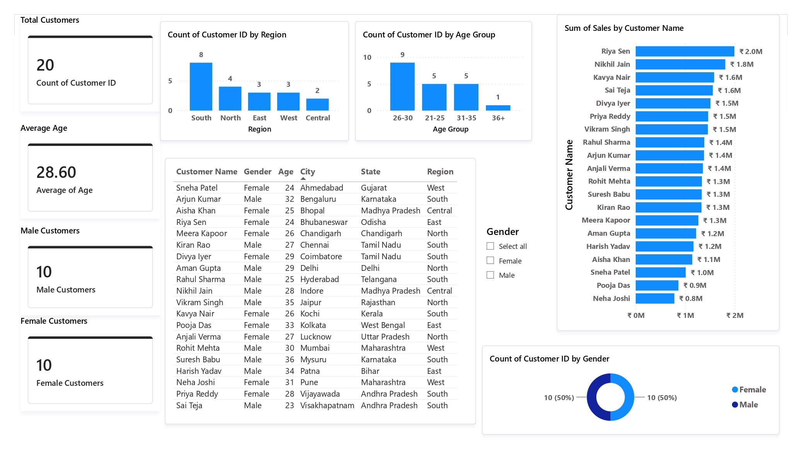
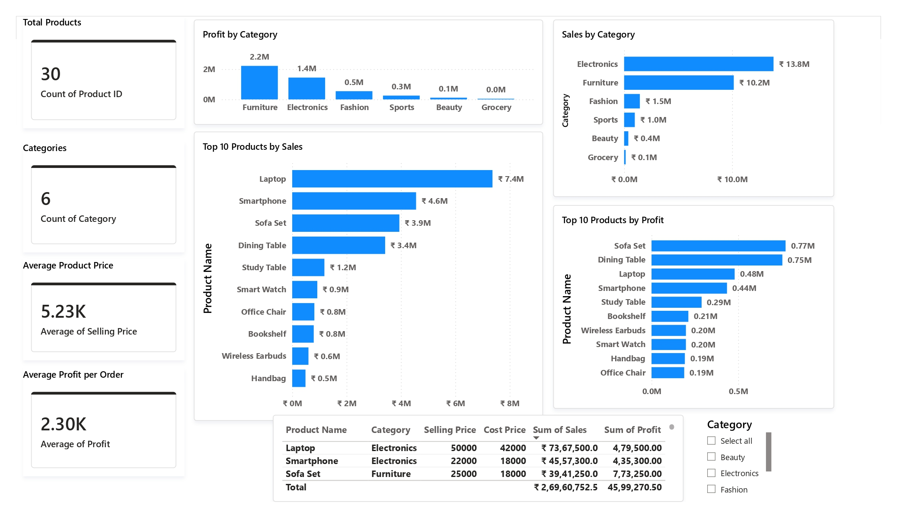
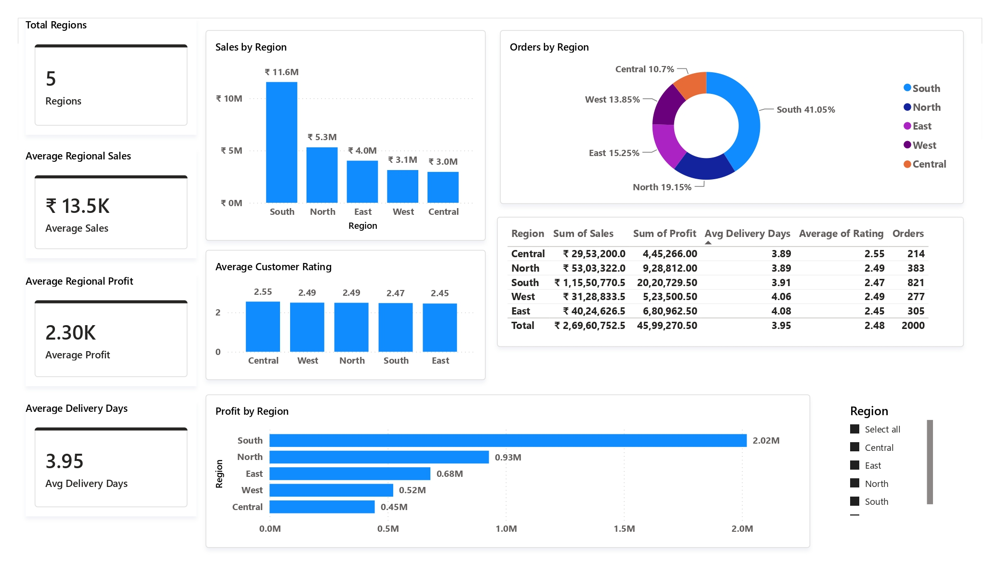
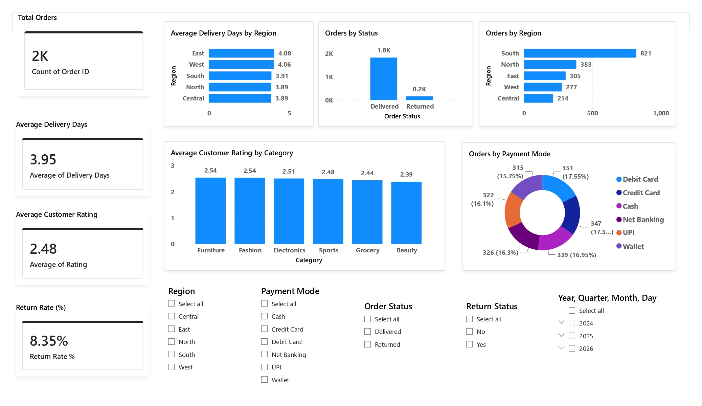
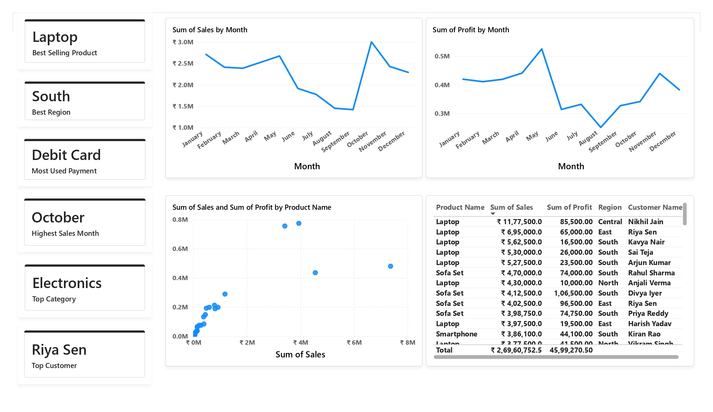

# 📊 Retail Business Intelligence Dashboard

A comprehensive **7-page interactive Power BI dashboard** developed to analyze retail business performance using sales, customer, product, regional, and delivery data.

---

# 🖼 Dashboard Preview

## Executive Dashboard

---

## Customer Analytics

---

## Product Analytics

---

## Regional Performance

---

## Sales Performance Analysis

---

## Order & Delivery Analysis

---

## Business Insights

---

# 📌 Project Overview

This dashboard helps businesses monitor:

- Total Sales
- Total Profit
- Customer Insights
- Product Performance
- Regional Performance
- Salesperson Performance
- Delivery Analysis
- Business Insights

---

# 🛠 Tools Used

- Power BI Desktop
- Microsoft Excel
- Power Query
- DAX (Data Analysis Expressions)

---

# 📄 Dashboard Pages

### 1️⃣ Executive Dashboard
- Total Sales
- Total Profit
- Total Orders
- Total Customers
- Sales Trend
- Sales by Category
- Sales by Region

### 2️⃣ Customer Analytics
- Customer Demographics
- Gender Distribution
- Age Group Analysis
- Region-wise Customers
- Top Customers

### 3️⃣ Product Analytics
- Product Sales
- Product Profit
- Category Analysis
- Top Selling Products
- Product Pricing

### 4️⃣ Regional Performance
- Sales by Region
- Profit by Region
- Delivery Days
- Customer Ratings

### 5️⃣ Sales Performance Analysis
- Salesperson Performance
- Profit Analysis
- Payment Mode Analysis
- Order Status Analysis

### 6️⃣ Order & Delivery Analysis
- Delivery Performance
- Return Rate
- Order Status
- Payment Methods
- Regional Delivery Analysis

### 7️⃣ Business Insights
- 🏆 Best Selling Product
- 🌍 Best Performing Region
- 💳 Most Used Payment Method
- 📈 Highest Sales Month
- 👤 Top Customer
- 📦 Top Product Category

---

# ⭐ Key Features

- Interactive Dashboard
- KPI Cards
- Drill-down Analysis
- Dynamic Filters (Slicers)
- Cross-filtering
- Business Insights
- Clean Dashboard Design

---

# 📂 Files Included

- Retail_Business_Intelligence_Dashboard.pbix
- Retail_Dataset.xlsx
- Retail_Business_Intelligence_Dashboard.pdf

---

# 👩‍💻 Developed By

**Samala Sri Jyothika**
